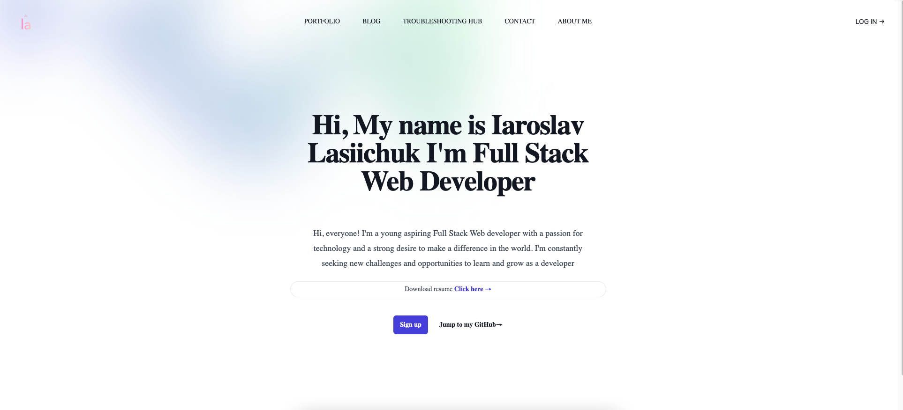
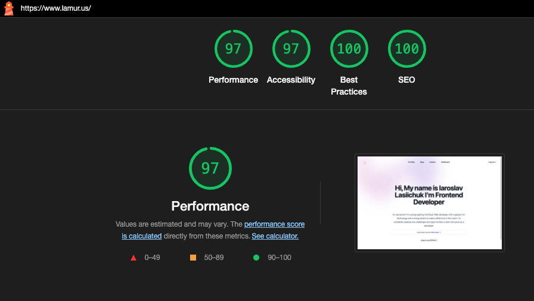

# Portfolio Iaroslav Lasiichuk

## Description

As a web developer, it's important to have a strong online presence to showcase your work and collaborate with other developers.

## Link to deployed application

Link to deployed application  [Click](https://www.lamur.us)

## Installation

To run the application, follow these steps:

1. > Clone the repository to your local machine.
2. > Open the terminal and navigate to the root directory of the project.
3. > Run `npm run install` to install the necessary dependencies.
4. > Run `npm run develop` to start the application. This will start up the application.

## Screenshot

## Contributing

Contributing
Contributions are welcome! If you would like to contribute to this project, please fork the repository and submit a pull request.

## Support

- [MDN](https://developer.mozilla.org/en-US/) 

- [Google](https://Google.com)

## Questions

If you have any questions about this project, please feel free to reach out to me:
  
- [Contact - Full Stack Coder - Iaroslav Lasiichuk](mailto:lasiichuki@gmail.com)
